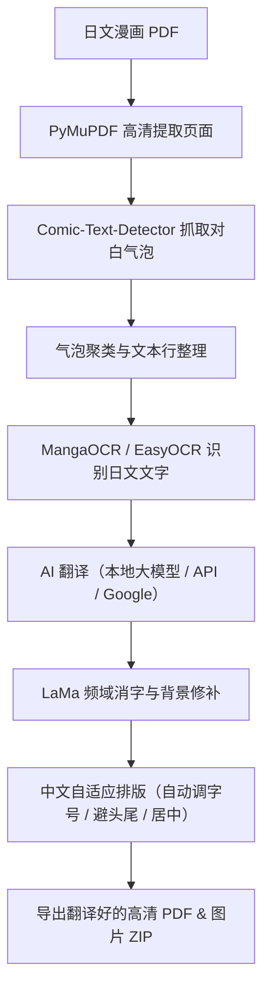

### 漫画 / PDF 自动翻译与排版引擎

[](https://www.python.org/)
[](https://fastapi.tiangolo.com/)
[-orange.svg)]()

一个全本地运行、保留原图画质的漫画 PDF 自动翻译与排版重绘工具。主要针对日文漫画的竖排排版、网点纸底纹以及各种对白气泡做优化。

---

## 📖 为什么会有这个项目？（作者的话）

这个项目其实初衷很简单，**就是做给买了正版日文漫画、但日文又看不懂的人用的**。

我自己也是买了喜欢的日文漫画回来，结果边看边拿手机开翻译软件逐句扫描，真的很麻烦、很扫兴，看几页就觉得很累，完全没有办法好好享受看漫画的过程。

为了能像看中文漫画那样一口气顺顺读完，我就自己想了这套自动翻译和排版的流水线方案，然后再通过 **AI 补助 / 协同编写代码** 把整个项目做出来并完成各种调优。

准确度大约~75-85%

---

## 💻 跑在什么配置的电脑上？（实测硬件）

我的电脑不是什么顶配工作站，就是一台很普通的笔记本：

- **显卡 (GPU)**：NVIDIA GeForce RTX 3050 Laptop GPU（**4GB 显存** 笔记本版）
- **处理器 (CPU)**：AMD Ryzen 5 7535HS
- **内存 (RAM)**：16 GB

### 针对 4GB 笔记本小显存的调优
因为 4GB 显存非常有限，平时跑大模型或图像修复很容易直接爆显存（CUDA Out of Memory）。所以整个项目特别针对这点做了很多细节调优：
- **动态显存调度**：把大模型翻译、OCR 识别和消字修复在内存和显存之间合理安排，错开高峰，确保 4GB VRAM 不会崩。
- **并发流水线**：页面提取和翻译重叠进行，省去傻傻等待的时间，实测 30 页漫画大概 2 分多钟就能搞定。
- **智能消字**：普通的白底气泡直接极速修掉；有网点背景的复杂对白框才裁剪出来丢给修复模型处理，既保留网点质感又省显存。

---

## 🏗️ 核心流程



---

## 🧠 使用的模型来源（开源致谢）

项目的核心架构、流程机制与排版逻辑是作者自己构想并通过 AI 协同实现的；底层的核心模型均来自开源社区的优秀成果，这里列出模型出处与致敬：

1. **文字检测 (Text Detection)**：[Comic-Text-Detector](https://github.com/dmMaze/comic-text-detector)
   - 专门训练用来识别漫画对白框与气泡的模型，抓气泡很准。
2. **日文识别 (OCR)**：[MangaOCR](https://github.com/kha-white/manga-ocr)
   - 专针对日漫字体、手写体和竖排排版训练的文字识别模型。
   - *(英文/其他备用：[EasyOCR](https://github.com/JaidedAI/EasyOCR))*
3. **背景消字 (Inpainting)**：[LaMa (Large Mask Inpainting)](https://github.com/advimman/lama)
   - 基于快速傅里叶卷积的图像修复模型，擦掉日文后可以很好保留网点底纹。
4. **翻译中枢 (Translation)**：
   - 本地通义千问 Qwen 大模型：[QwenLM/Qwen](https://github.com/QwenLM)
   - ACG 领域微调的二次元翻译模型：[SakuraLLM/Sakura-13B](https://github.com/SakuraLLM/Sakura-13B)
5. **排版参考**：[manga-image-translator](https://github.com/zyddnys/manga-image-translator)
   - 启发了气泡文本框处理和排版重绘的部分思路。
6. **PDF 解析底座**：[PyMuPDF (fitz)](https://github.com/pymupdf/PyMuPDF)
   - 快速高效地把 PDF 解析成高清页面。

---

## 🌐 翻译方式选择（支持灵活替换）

虽然默认配置是为了适配 4GB 显存的本地轻量大模型，但系统保留了灵活的切换支持：

- **配置更好的电脑**：如果你用的是桌面端显卡或者显存比较大（比如 8GB / 12GB / 16GB 以上），完全可以换成参数量更大的本地模型（比如 7B 或 14B 版的 Qwen / Sakura），翻译出来的语句和语感会更丰富细腻。
- **免显存的 Google 翻译**：系统内置了 Google 翻译选项，完全不吃显存，随点随翻。
- **外接 AI API**：如果你不想给电脑负担，也可以直接接入各大主流的在线 AI 接口（比如 OpenAI ChatGPT、DeepSeek、Google Gemini、Groq 等），走云端翻译。

---

## ✨ 主要功能

- **日文竖排自动转横排中文**：自动根据气泡大小通过二分法计算最合适的字号，文字自动居中，并处理标点避头尾，排版看起来自然。
- **支持专有漫画词典**：可以针对不同漫画分别建立术语表（`data/terms/<漫画名>.json`），角色名、招式名、世界观名词前后一致，不会每一页翻出来的名字都不一样。
- **Web 界面与实时进度**：基于 FastAPI 搭建的网页界面，有实时的进度条和控制台日志，也能直接查看预览图和排版微调。
- **直接导出**：一键生成翻译后的高清 PDF，或者把每页图片打包成 ZIP 下载。

---

## 🚀 快速上手使用

### 1. 安装环境
电脑需要先装好 Python 3.10+，拉取项目并安装依赖：
```bash
git clone https://github.com/TeeChinYean/pdf_translate_v2_async_pipeline.git
cd pdf_translate_v2_async_pipeline
pip install -r pdf_translate/requirements.txt
```

### 2. 一键启动
在 Windows 里直接双击运行根目录下的脚本：
```bash
start_web_app.bat
```
*(会自动拉起后台推理服务并打开 Web 服务)*

### 3. 打开网页使用
打开浏览器进入：
```text
http://127.0.0.1:8000
```
把日文漫画 PDF 拖进去，选好要翻译的页数，点击开始即可。

---

## ⚖️ 免责声明

本项目仅供个人对自己购买的正版漫画进行学习、研究与个人辅助阅读使用。请尊重原作者与出版社的版权，切勿用于商业用途或二次非法传播。
