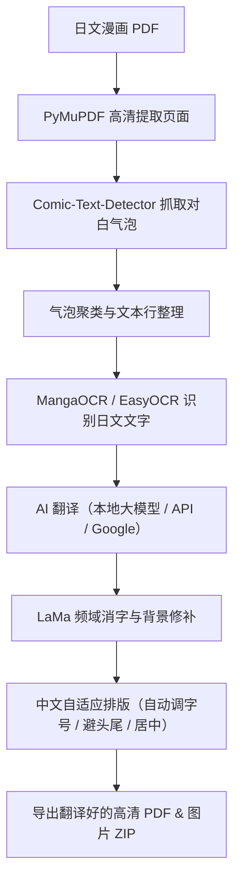

### 漫画 / PDF 自动翻译与排版引擎

[](https://www.python.org/)
[](https://fastapi.tiangolo.com/)
[-orange.svg)]()

一个全本地运行、保留原图画质的漫画 PDF 自动翻译与排版重绘工具。主要针对日文漫画的竖排排版、网点纸底纹以及各种对白气泡做优化。

---

## 📖 为什么会有这个项目？（作者的话）

这个项目其实初衷很简单，**就是做给买了正版日文漫画、但日文又看不懂的人用的**，至于如何获得pdf就需要自己找方法，可以拍照转为pdf也行。

我自己通过 **AI 补助 / 协同编写代码** 把整个项目做出来并完成各种调优。

准确度大约~75-85%

部分功能没用了但懒惰删。

---

## 💻 跑在什么配置的电脑上？（实测硬件）

- **环境**：Window 11 Home
- **显卡 (GPU)**：NVIDIA GeForce RTX 3050 Laptop GPU（**4GB 显存** 笔记本版）
- **处理器 (CPU)**：AMD Ryzen 5 7535HS
- **内存 (RAM)**：16 GB

### 针对 4GB 笔记本小显存的调优
因为 4GB 显存非常有限，平时跑大模型或图像修复很容易直接爆显存（CUDA Out of Memory）。所以整个项目特别针对这点做了很多细节调优：
- **动态显存调度**：把大模型翻译、OCR 识别和消字修复在内存和显存之间合理安排，错开高峰，确保 4GB VRAM 不会崩。
- **并发流水线**：页面提取和翻译重叠进行，省去傻傻等待的时间，实测 30 页漫画大概 2 分多钟就能搞定。
- **智能消字**：普通的白底气泡直接极速修掉；有网点背景的复杂对白框才裁剪出来丢给修复模型处理，既保留网点质感又省显存。

---

### 效果

> 出于版权考虑，仓库不放任何漫画页面的截图。用你自己购买的漫画跑一页就能看到效果：日文竖排气泡被擦掉，换成排好版的中文（横排或竖排可选），网点底纹保留。
>
> 翻译效果约 75–85% 对，部分字体可能会偏小、偏大或发生重叠。

---

## 🏗️ 核心流程



---

## 🧠 使用的模型来源（开源致谢）

项目的核心架构、流程机制与排版逻辑是作者自己构想并通过 AI 协同实现的；底层的核心模型均来自开源社区的优秀成果，这里列出模型出处与致敬：

1. **文字检测 (Text Detection)**：[Comic-Text-Detector](https://github.com/dmMaze/comic-text-detector)
   - 专门训练用来识别漫画对白框与气泡的模型，抓气泡很准。
2. **日文识别 (OCR)**：[MangaOCR](https://github.com/kha-white/manga-ocr)
   - 专针对日漫字体、手写体和竖排排版训练的文字识别模型。
   - *(英文/其他备用：[EasyOCR](https://github.com/JaidedAI/EasyOCR))*
3. **背景消字 (Inpainting)**：[LaMa (Large Mask Inpainting)](https://github.com/advimman/lama)
   - 基于快速傅里叶卷积的图像修复模型，擦掉日文后可以很好保留网点底纹。
4. **翻译中枢 (Translation)**：
   - 本地通义千问 Qwen 大模型：[QwenLM/Qwen](https://github.com/QwenLM)
   - ACG 领域微调的二次元翻译模型：[SakuraLLM/Sakura-13B](https://github.com/SakuraLLM/Sakura-13B)
5. **排版参考**：[manga-image-translator](https://github.com/zyddnys/manga-image-translator)
   - 启发了气泡文本框处理和排版重绘的部分思路（本仓库不包含它的代码）。
6. **PDF 解析底座**：[PyMuPDF (fitz)](https://github.com/pymupdf/PyMuPDF)
   - 快速高效地把 PDF 解析成高清页面。（PyMuPDF 是 AGPL-3.0，见下方许可说明）

> 各模型的许可证与出处见 [THIRD_PARTY_NOTICES.md](THIRD_PARTY_NOTICES.md)。本项目不包含、也不分发任何模型权重，请自行下载并遵守它们各自的许可证。

---

## 🌐 翻译方式选择（支持灵活替换）

虽然默认配置是为了适配 4GB 显存的本地轻量大模型，但系统保留了灵活的切换支持：

- **下载模型是 Optional（可选）的**：如果你电脑没有下载本地大模型（Qwen / Sakura），不用担心，代码里**内置开着 Google 翻译自动兜底**检测..
- **配置更好的电脑**：如果你用的是桌面端显卡或者显存比较大（比如 8GB / 12GB / 16GB 以上），完全可以换成参数量更大的本地模型（比如 qwen3.8或sakura）
- **外接 AI API**：如果你不想给电脑负担，也可以直接接入各大主流的在线 AI 接口（比如 OpenAI ChatGPT、DeepSeek、Google Gemini、Groq 等），走云端翻译。

---

## ✨ 主要功能

**排版与重绘**
- **日文竖排自动转中文**：根据气泡大小用二分法计算最合适的字号，文字自动居中，并处理标点避头尾。
- **译文排版方向可选**：横排（从左到右）、竖排（列从左到右）、竖排（列从右到左，日漫读序），或 **自动**——按原文文字的排列逐框判断（原文竖排就竖排，横排就横排）。默认是「自动」，编辑器里每个框还能单独改。
- **可选字体**：整本统一选一个字体，也能在编辑器里给某个框单独换。字体来自系统（微软雅黑、黑体、宋体等）或放进 `pdf_translate/fonts/` 的自备字体，只列出真正含中文字形的。
- **智能消字**：普通白底气泡直接极速修补；有网点背景的复杂对白框才裁剪出来交给 LaMa 修复，既保留网点质感又省显存。

**翻译**
- **多种源语言**：日文（本地 Qwen / Sakura，MangaOCR 识别）、韩文（EasyOCR + Google），英文等其他语言走 Google 翻译。
- **没有本地大模型也能用**：检测不到本地 LLM 时自动改用 Google 翻译，不会卡住。
- **译文自动检查**：翻译后检查有没有残留假名 / 外文字母 / 多余符号（保留语气符号），不合格自动重译。
- **专有漫画词典**：可以针对不同漫画分别建立术语表（`data/terms/<漫画名>.json`），角色名、招式名、世界观名词前后一致（但可能和你自己知道的译名不同）。

**检测框编辑器（Box Editor）**
- 可以选择 **先调框再继续**（提取 + 翻译完成后暂停，调好再重绘一次），或 **翻译结束后再调**（出结果后点「调整检测框」）。
- 拖动 / 缩放 / 新增 / 删除 / 撤销检测框，直接改译文（支持手动换行）；新画的框会自动 OCR + 翻译，也可以手动重新识别。
- **看得到最终字号**：每个框显示重绘后的字号，并在框里按真实断行预览译文；也可以给某个框手动指定字号、方向和字体。
- **只重绘改过的页**，其余页沿用上次结果，改一两页不用整本重来。

**校对与导出**
- **Excel 台本**：导出原文 / 译文对照的 `xlsx`，在 Excel 里校对后上传回填，**直接跳过 OCR 和翻译**，只重新消字与排版。
- **一键导出**：翻译后的高清 PDF，或把每页图片打包成 ZIP。
- **Web 界面与实时进度**：基于 FastAPI 的网页，有实时进度条和控制台日志，可直接预览。

**CPU / GPU**
- **自动检测 GPU**：有 GPU 才用，没有就整套流程全走 CPU（LaMa 用 ONNX CPU，OCR 和检测也走 CPU）。
- **手动切换**：`start_web_app.bat cpu`（纯 CPU）、`start_web_app.bat gpu`（优先 GPU），或设环境变量 `CPU_ONLY=1`。详见下面「一键启动」。

---

## 🚀 快速上手使用

### **注意**

需要自己去下载 qwen3.5:4b, MangaOCR, EasyOCR, LaMa，以及运行本地 Qwen 用的 **llama-server.exe**（见下方「下载 llama-server.exe」）。

### 下载 llama-server.exe（本地 Qwen 翻译必需）
本地 Qwen 由 [llama.cpp](https://github.com/ggml-org/llama.cpp) 的 `llama-server.exe` 运行（端口 `127.0.0.1:18089`），本项目**不附带**这个程序，需要自己下载：

1. 打开 [llama.cpp Releases](https://github.com/ggml-org/llama.cpp/releases)，下载 Windows 版：
   - NVIDIA 显卡：`llama-<版本>-bin-win-cuda-12.x-x64.zip`，以及同版本的 `cudart-llama-bin-win-cuda-12.x-x64.zip`（CUDA 运行库）
   - 其他显卡：`llama-<版本>-bin-win-vulkan-x64.zip`
2. 解压到 `qwen_turbovec_rag/models/llama-cuda/bin/`（Vulkan 版放 `models/llama-vulkan/bin/`），确认里面有 `llama-server.exe`；CUDA 版还要有 `cudart64_12.dll`、`cublas64_12.dll`。
3. `qwen_turbovec_rag` 文件夹放在本项目的同级目录（或用环境变量 `TURBOVEC_RAG_DIR` 指定路径），启动时会自动拉起 llama-server。

不下载也能用：检测不到本地 LLM 时会自动改用 Google 翻译。

> 显存提示：本项目自动启动 llama-server 时把上下文限制为 8192（环境变量 `PDF_LLM_MAX_CTX` 可改），剩下的显存留给 LaMa / OCR。如果 llama-server 已经由 `qwen_turbovec_rag` 先启动，就沿用它的上下文（默认用 `--fit` 把显存加到只剩约 200 MB）；想用 8k，先关掉它再启动本项目。需要较新的 `qwen_turbovec_rag`（支持 `LLM_MAX_CTX`），旧版会忽略这个限制。

### 1. 安装环境
电脑需要先装好 Python 3.10+，拉取项目并安装依赖：
```bash
pip install -r pdf_translate/requirements.txt
```

### 2. 一键启动
在 Windows 里直接双击运行根目录下的脚本：
```bash
start_web_app.bat
```
*(会自动拉起后台推理服务并打开 Web 服务)*

也可以直接选模式启动：

| 命令 | 模式 | 说明 |
|---|---|---|
| `start_web_app.bat` | 自动 | 检测到 GPU 才用 GPU，没有就全用 CPU |
| `start_web_app.bat gpu` | GPU | 显存够用时 LaMa / MangaOCR / 检测模型用 GPU（串行模式的 OCR 也用，不受 20 页门槛限制），并启动本地 Qwen |
| `start_web_app.bat cpu` | 纯 CPU | 完全不用 GPU；不启动 Qwen，翻译走 Google |

PowerShell 版本：`.\start_web_app.ps1 -Mode cpu`（或 `gpu` / `auto`）。

### 3. 打开网页使用
打开浏览器进入：
```text
http://127.0.0.1:8000
```
把日文漫画 PDF 拖进去，选好要翻译的页数，点击开始即可。

---

## ⚖️ 免责声明

本项目仅供个人对**自己合法购买的正版漫画**进行学习、研究与个人辅助阅读使用。

- 本项目**不包含、不提供、也不抓取**任何漫画内容；如何取得 PDF 由使用者自行负责（例如自己拍照 / 扫描自己购买的书）。
- 使用者须自行确保拥有所处理内容的合法使用权，并遵守所在地区的法律；请尊重原作者与出版社的版权，切勿用于商业用途，或把翻译结果二次传播 / 上传到网络。
- 翻译由 AI 自动完成，可能有错，仅供辅助阅读。
- 作者不对使用者的行为及其后果负责。

## 📄 许可证

本项目源代码使用 [MIT License](LICENSE)。它调用的第三方模型与库各有自己的许可证（见 [THIRD_PARTY_NOTICES.md](THIRD_PARTY_NOTICES.md)），其中 PyMuPDF 为 AGPL-3.0：个人本地使用无额外要求；若要打包分发或作为网络服务提供给他人，请先阅读该文件里的说明。
