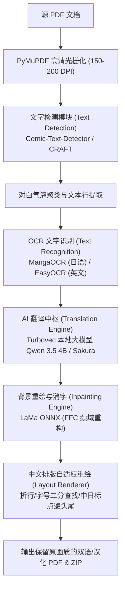

# ⚡ ANTIGRAVITY - 高保真漫画/文档 PDF 极速排版翻译引擎

基于 **FastAPI + 异步并发调度队列 + SSE 实时流式推送** 的全本地化漫画/文档 PDF 翻译与排版重绘引擎。针对日漫竖排排版、网点纸底纹与复杂对白框场景深度优化。

---

## 🏗️ 核心架构流水线



---

## 🧩 核心模块组成

| 环节 | 当前模块 / 模型 | 说明与技术特点 |
| :--- | :--- | :--- |
| **文档解析与光栅化** | `PyMuPDF (fitz)` | 毫秒级多线程页面光栅化渲染，保证矢量文字与图片无损解析。 |
| **文字检测 (Detection)** | `comic-text-detector.onnx`<br>*(备选: CRAFT)* | 专门在漫画数据上训练的 YOLOv8 架构，直接检测整块对白气泡并处理竖排文本。 |
| **文字识别 (OCR)** | `MangaOCR`<br>*(备选: EasyOCR)* | 专为日漫手写体、印刷体和复杂背景文本设计的端到端 Vision-Encoder 模型。 |
| **翻译引擎 (Translation)** | `Turbovec Qwen 3.5 4B`<br>*(本地 Port 18088/18089)* | 针对 4GB 显存显卡优化（~3.1GB VRAM），全 GPU 满速 35~50 tokens/s 推理。 |
| **背景消字 (Inpainting)** | `LaMa ONNX (big-lama)` | Fast Fourier Convolutions 全局频域卷积，完美延续网点纸与复杂线稿底纹。 |
| **排版与字号自适应** | `PDFLayoutRenderer` | 二分搜索算法在气泡安全区域内自适应调节字号，排版自然居中，支持侧边栏实时微调。 |

---

## 📋 未来升级与待办清单 (Roadmap & Future Plan)

> 💡 详细的技术规格、性能对比矩阵与任务分解，请参阅完整的 [ROADMAP.md](file:///c:/Users/Work/Desktop/project/pdf_translate_v2_async_pipeline/ROADMAP.md)。

以下为后续版本规划接入与升级的核心技术清单：

### 1. 🔍 文字检测与 OCR 模块扩展
- [ ] **接入 PaddleOCR (PP-OCRv4 / PP-OCRv5)**：
  - **定位**：全语种通用极速 OCR 补充引擎，与 MangaOCR 形成动静互补。
  - **适用场景**：韩漫条漫（Webtoon）、繁体中文、欧美漫画（英/法/德/西）的高精度文字检测与识别。
  - **核心优势**：
    1. **超轻量**：纯 ONNX 运行时仅约 15~20MB，零 PyTorch/Paddle 巨型框架依赖；
    2. **超低延迟**：单气泡框识别耗时仅 20~50ms，速度比 ViT 快 6~10 倍；
    3. **自带角度分类器 (Angle Classifier)**：精准纠正倾斜与旋转文本，大幅降低倒置错读率。
- [ ] **深度固化 Comic-Text-Detector**：
  - 全面替代通用 CRAFT，实现气泡框级的多边形掩膜提取与语意完整断句。

### 2. 🎨 背景重绘 (Inpainting) 进阶
- [ ] **LaMa ONNX 混合分级加速 (Hybrid Inpainting)**：
  - 纯白气泡走极速采样（<2ms），网点纸与复杂背景走 LaMa ONNX 频域生成（保证画质与速度兼备）。
- [ ] **Manga-Image-Translator 专有日漫微调权重 (lama_manga)** 支持。

### 3. 🌐 翻译模型与多语种生态
- [ ] **Sakura ACG 汉化专项模型评估**：
  - 本地轻量评估：Sakura-4B / Sakura-7B (Q4_K_M) 离线运行。
  - 云端顶配选项：接入 Sakura-14B-Qwen2.5 在线 API，实现零本地显存开销的顶级小说/漫画文风润色。
- [ ] **专有名词 / 人名地名术语表 (Glossary) 前端动态编辑支持**。

---

## 🚀 快速启动

1. **环境准备**：
   ```bash
   pip install -r pdf_translate/requirements.txt
   ```
2. **一键启动**：
   双击根目录下的 `start_web_app.bat`，系统将自动检查并唤起本地 Turbovec Qwen 大模型，并启动 FastAPI 服务（Port 8000）。
3. **访问界面**：
   浏览器打开 `http://127.0.0.1:8000` 即可开始文档上传与实时调优。
