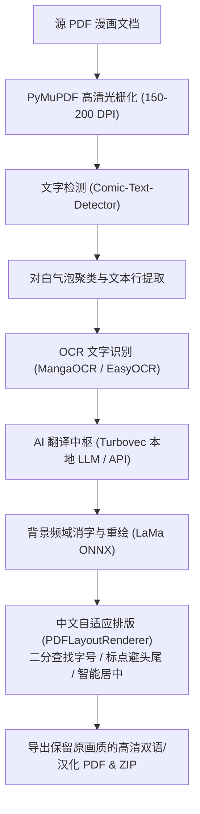

# ⚡ Manga PDF Translator (v2 Async Pipeline)
### 高保真漫画 / 文档 PDF 极速排版翻译引擎

[](https://www.python.org/)
[](https://fastapi.tiangolo.com/)
[](LICENSE)
[-orange.svg)]()

基于 **FastAPI + 异步并发调度队列 + SSE 实时流式推送** 的全本地化漫画/文档 PDF 翻译与排版重绘引擎。针对日漫竖排文字排版、网点纸底纹与复杂对白框场景深度优化。

---

## 📖 项目初心与开发故事 (Background & Motivation)

- **为什么做这个项目？**
  本项目的诞生非常简单直接 —— **给购买了正版日文漫画，但因为看不懂日语而苦恼的读者使用**。
  作者（我）购买了心爱的日文原版漫画，但每次阅读时都要掏出手机用翻译软件逐句逐页拍照查词，体验极其繁琐、割裂且严重破坏沉浸感。为了能够像读中文母语漫画一样一口气畅快读完整本，作者决定打造这套全自动、高保真重绘的漫画 PDF 翻译流水线。

- **构思与开发方式**：
  从整体功能架构、气泡流式流水线机制、4GB 笔记本显存极限预算调度、到自适应字号排版与 Web 界面交互，均由**作者（我）根据实际漫画阅读痛点自主构思与设计**；研发过程中深度结合 **AI 辅助 / 协同编码 (AI Copilot & Agentic Coding)** 协助攻坚工程细节与调试落地。

---

## 💻 测试硬件与 4GB 显存极限调优 (Tested Hardware Specs)

本项目的所有性能基准与全本漫画压力测试，均在以下**入门级主流轻薄/游戏本**实机上调优并测试通过：

| 组件 | 配置规格 |
| :--- | :--- |
| **GPU (显卡)** | **NVIDIA GeForce RTX 3050 Laptop GPU (4GB VRAM)** (移动端笔记本版) |
| **CPU (处理器)** | **AMD Ryzen 5 7535HS** (6 核 12 线程) |
| **RAM (内存)** | **16 GB DDR5** |

### 4GB 笔记本有限显存优化亮点
- **动态显存预算调度 (VRAM Budget Scheduling)**：精细化控制 LLM 大模型、OCR 识别引擎与 LaMa 修复模型的内存生命周期与换入换出，在 4GB VRAM 的严苛约束下全速运转，**杜绝 CUDA Out of Memory (OOM)**。
- **并发重叠流水线 (Async Overlap Pipeline)**：页面提取（GPU/CPU 子进程 OCR）与 LLM 翻译重叠并发推进，将 30 页全本漫画处理时间压缩至约 144 秒。
- **混合消字策略 (Hybrid Inpainting)**：白底纯色气泡走微秒级 Telea 修复；复杂网点与暗底区域采用按框裁剪的 LaMa ONNX 频域生成，兼顾原生网点画质与计算速度。

---

## 🏗️ 核心架构流水线 (Architecture Pipeline)



---

## 🧠 使用的模型来源与致谢 (Model Sources & Credits)

本项目集成了开源社区优秀的 AI 模型与技术方案，核心模型来源如下：

1. **文字检测 (Text Detection) - [Comic-Text-Detector](https://github.com/dmMaze/comic-text-detector)**
   - 专为漫画对白框与文字气泡训练的高精度 YOLO 架构检测模型，支持密集排版与竖排文本块精准切割。
2. **文字识别 (OCR) - [MangaOCR](https://github.com/kha-white/manga-ocr)**
   - 专为日漫手写体、印刷体、拟声词与网点纸背景设计的端到端 Vision-Encoder-Decoder 模型。
   - *(多语种/英文备选: [EasyOCR](https://github.com/JaidedAI/EasyOCR))*
3. **背景消字 (Inpainting) - [LaMa (Large Mask Inpainting)](https://github.com/advimman/lama)**
   - 基于快速傅里叶卷积 (Fast Fourier Convolutions, FFC) 的高分辨率图像修复模型，完美延续复杂背景与网点纸底纹。
4. **翻译中枢 (Translation Engine) - Turbovec 本地大模型 / Sakura**
   - **通义千问 Qwen 系列**: 来自阿里开源的 [QwenLM/Qwen](https://github.com/QwenLM) 大语言模型，结合 Turbovec 4-bit 量化引擎实现极速离线推理。
   - **Sakura ACG 模型**: 来自二次元轻小说/漫画专有微调项目 [SakuraLLM/Sakura-13B](https://github.com/SakuraLLM/Sakura-13B)。
5. **排版与渲染思路参考 - [Manga-Image-Translator](https://github.com/zyddnys/manga-image-translator)**
   - 参考并借鉴了开源漫画翻译社区优秀的气泡分析与排版重绘流水线思路。
6. **文档底层解析 - [PyMuPDF (fitz)](https://github.com/pymupdf/PyMuPDF)**
   - 毫秒级多线程页面解析与高质量光栅化渲染引擎。

---

## 🌐 翻译引擎替代方案 (Translation Alternatives)

系统设计了松耦合的翻译中枢接口，支持根据您的设备条件灵活切换：

- **更大参数量本地模型**：若您的电脑具备更大显存（如 8GB / 12GB / 16GB 或桌面端独立显卡），可直接切换至 7B、14B 等更高参数量的大模型（如 Sakura-14B-Qwen2.5），获得更加文学化、风格化的汉化质感。
- **Google 翻译 (内置免配置)**：轻量无负担，无需本地大模型与显存占用，适合配置较低或注重极速翻译的场景。
- **外部 AI API 接入**：原生兼容标准接口，可自由接入各类云端大模型服务：
  - OpenAI (GPT-4o / GPT-4o-mini)
  - DeepSeek (DeepSeek-V3 / DeepSeek-R1)
  - Google Gemini (Gemini 2.5 Flash / Pro)
  - Groq (超高并发低延迟推理)

---

## ✨ 核心功能亮点 (Key Features)

- **日文竖排自动转横排排版**：内置字号自适应二分查找算法、中日标点避头尾（Kinsoku Shori）规则与气泡几何中心对齐。
- **专属漫画专有名词表 (Glossary)**：支持针对不同漫画系列独立维护角色名、地名与技能术语库（`data/terms/<作品名>.json`），自动识别并保证整本漫画人名译法前后一致。
- **现代化实时 WebUI**：基于 SSE (Server-Sent Events) 实时推送提取、翻译、重绘各阶段进度与性能指标；支持单页交互式热微调与对比预览。
- **多样化输出**：一键生成全高清保留原尺寸的汉化 PDF 文档，并支持打包下载逐页高清图片 ZIP 压缩包。

---

## 🚀 快速上手 (Quick Start)

### 1. 环境准备
确保已安装 Python 3.10+，克隆本仓库并安装核心依赖：
```bash
git clone https://github.com/TeeChinYean/pdf_translate_v2_async_pipeline.git
cd pdf_translate_v2_async_pipeline
pip install -r pdf_translate/requirements.txt
```

### 2. 一键启动
在 Windows 环境下，直接双击运行根目录下的脚本：
```bash
start_web_app.bat
```
*(脚本会自动初始化环境、检测并拉起本地推理引擎，随后启动 FastAPI Web 服务。)*

### 3. 访问与使用
打开浏览器访问：
```text
http://127.0.0.1:8000
```
上传日文漫画 PDF，选择页码范围即可开始自动化极速翻译与排版。

---

## ⚖️ 免责声明 (Disclaimer)

本项目仅供个人对正版购买的漫画进行学习研究与无障碍辅助阅读使用。使用者请严格遵守当地版权法，尊重原作者与出版方的合法知识产权，请勿将翻译衍生文件用于任何商业传播或非法途径。
