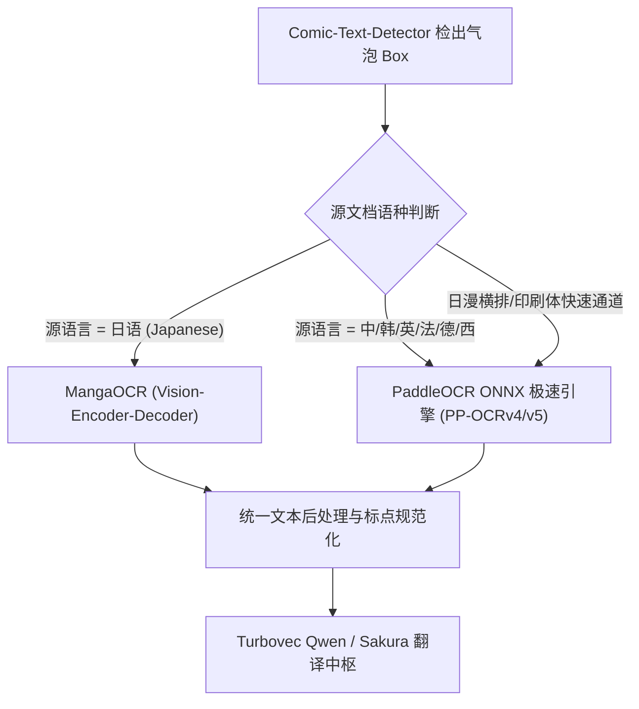
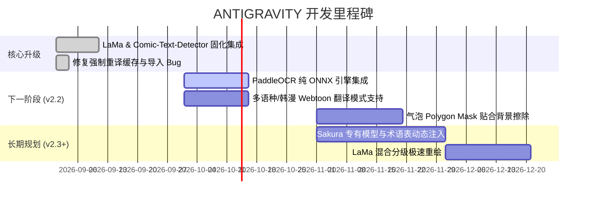

# 🗺️ 项目技术演进与未来待办清单 (Roadmap & Technical Backlog)

本文档记录 **ANTIGRAVITY 高保真漫画/文档 PDF 翻译引擎** 的中长期技术演进规划，重点规划了文字识别 (OCR)、气泡检测 (Detection)、背景消除 (Inpainting) 与大模型翻译 (LLM) 的升级路线。

---

## 📌 当前架构状态 (Current Status)

| 核心组件 | 当前实现 | 运行环境 / 硬件消耗 | 状态 |
| :--- | :--- | :--- | :--- |
| **文字检测 (Detection)** | `Comic-Text-Detector ONNX` | GPU (DirectML, ~112ms/页) | ✅ 已就绪 / 替代 CRAFT |
| **文字识别 (OCR)** | `MangaOCR (ViT)` | GPU / CPU (~300ms/气泡) | ✅ 日语首选 |
| **背景消字 (Inpainting)** | `LaMa ONNX (big-lama)` | CPU (ORT 4线程, ~1.5s/页) | ✅ 已就绪 / 频域重构 |
| **翻译引擎 (Translation)**| `Turbovec Qwen 3.5 4B` | 本地 Docker/GGUF (~3.1GB VRAM) | ✅ 稳定 35~50 tok/s |

---

## 🎯 待办清单一：PaddleOCR (PP-OCRv4 / PP-OCRv5) 深度集成计划

### 1.1 需求背景与定位
当前系统的 `MangaOCR` 在识别日漫的手写体、拟声词和纵排排版上有极高准确率，但存在以下局限：
1. **仅专精日语**：对韩漫条漫（Webtoon）、繁体中文、欧美漫画（美漫/法漫）无法识别或泛化能力不足。
2. **轻量与多语种互补**：需要一个超轻量、低延迟、全语种覆盖的工业级 OCR 引擎作为通用补充与备选。

**PaddleOCR (PP-OCRv4 / PP-OCRv5)** 是目前开源界速度最快、语种支持最全面的 OCR 工具链，支持纯 ONNX 运行时部署，非常契合本项目的本地化低显存架构。

### 1.2 引擎能力对比矩阵

```
┌───────────────────┬──────────────────────┬──────────────────────┬──────────────────────┐
│ 特性对比          │ MangaOCR (当前日漫)  │ PaddleOCR (计划接入)  │ EasyOCR (原有备选)   │
├───────────────────┼──────────────────────┼──────────────────────┼──────────────────────┤
│ 专精语言          │ 日语 (极强)          │ 80+ 语种 (中/英/韩等)│ 80+ 语种             │
│ 竖排与手写体      │ ★★★★★ 极高           │ ★★★★☆ 优秀           │ ★★☆☆☆ 一般           │
│ 文本方向分类 (cls)│ 依赖预处理           │ ★★★★★ 自带角度分类器  │ ★★☆☆☆ 较慢           │
│ 单图识别延迟      │ ~250-400 ms          │ ~20-50 ms (ONNX)     │ ~150-300 ms          │
│ 运行时依赖        │ PyTorch / Transformers│ 仅需 onnxruntime     │ PyTorch / Torchvision│
│ 内存/显存开销     │ ~800 MB              │ ~20-50 MB            │ ~500 MB              │
└───────────────────┴──────────────────────┴──────────────────────┴──────────────────────┘
```

### 1.3 技术实施方案 (Technical Architecture)



### 1.4 具体开发任务分解 (Tasks Breakdown)
- [ ] **Task 1: ONNX 模型轻量化整合**
  - 引入轻量级 `ppocrv4_det.onnx`, `ppocrv4_rec.onnx`, `ch_ppocr_mobile_v2.0_cls.onnx`。
  - 模型直接归档至 `pdf_translate/data/models/onnx/paddleocr/`，无需安装庞大的 PaddlePaddle 框架本体，直接通过 `onnxruntime` 推理。
- [ ] **Task 2: Extractor 动态路由调度**
  - 在 `core/extractor.py` 中实现 `_get_paddle_ocr()` 单例管理器。
  - 当前端选择非日语音源（如 `Korean Webtoon`, `English Comic`, `Traditional Chinese`）时，自动直通 PaddleOCR。
  - 增加气泡级方向矫正（0°/90°/180°/270°），解决条漫倾斜旋转文字问题。
- [ ] **Task 3: 异常降级兜底**
  - 当 MangaOCR 遇到低置信度乱码时，自动 fallback 到 PaddleOCR 进行二次校验投票。

---

## 🎯 待办清单二：Comic-Text-Detector 进阶能力开发

- [x] **第一阶段：ONNX 导出与 DirectML GPU 加速集成**（已完成，1024x1024 推理 112ms）。
- [ ] **第二阶段：多边形气泡分割（Segmentation Mask）提取**：
  - 目前仅使用矩形 Bounding Box (`blk`)。
  - 下一步接入模型输出的 `seg` 分割图，直接生成贴合气泡边缘的多边形精确轮廓，避免矩形框误伤对白框外的人物发丝和背景线稿。
- [ ] **第三阶段：文字方向分类（Horizontal / Vertical）感知**：
  - 利用模型检测输出中的行方向分类置信度，自动标记气泡是纵排还是横排，指导下游渲染排版。

---

## 🎯 待办清单三：LaMa 混合重绘与画质升级 (Inpainting Enhancement)

- [x] **第一阶段：LaMa ONNX 离线频域消字**（已完成，解决 OpenCV Telea 无法处理网点纸与网纹线稿的问题）。
- [ ] **第二阶段：混合级联加速策略 (Hybrid Inpainting)**：
  - **白底对白框快速通道**：对内部纯白气泡（`bg_val >= 235` 且方差极低），直接采用数学插值/平滑，执行耗时 <1ms。
  - **复杂背景神经通道**：仅将覆盖在画面线稿、网点纸、彩色插画上的复杂文字块送入 LaMa，整页处理速度提升 3~5 倍。
- [ ] **第三阶段：局部 Patch 裁剪推理**：
  - 当整页文字较少时，直接裁剪包含气泡的局部高分辨率小图送入 LaMa（保持原图 1:1 分辨率不变），实现极致细节保留。

---

## 🎯 待办清单四：翻译引擎与本地大模型体验 (LLM & Quality)

- [x] **Turbovec Qwen 3.5 4B 高速推理**（已适配 4GB 显存显卡，显存占用 3.1GB，推理 35~50 tok/s）。
- [ ] **Sakura-14B / Sakura-7B (Qwen2.5) 翻译评估**：
  - Sakura-7B (Q4_K_M) 本地显存与内存压测，对比漫画语境下的语气词和人称翻译质量。
  - 支持配置远程/局域网 OpenAI 兼容接口，允许高端用户使用专用翻译大卡。
- [ ] **动态漫画专用术语表 (Glossary / Terminology)**：
  - 允许在 Web 前端即时添加角色人名对照表（如 `レフ・レピシウス -> 莱夫·莱皮修斯`），大模型在翻译时强制遵循专有名词字典。
- [ ] **上下文连贯翻译 (Multi-turn Context Sliding Window)**：
  - 将上一页对白摘要注入当前页 Prompt，改善长对话语境脱节问题。

---

## 📅 版本排期规划 (Milestones)


